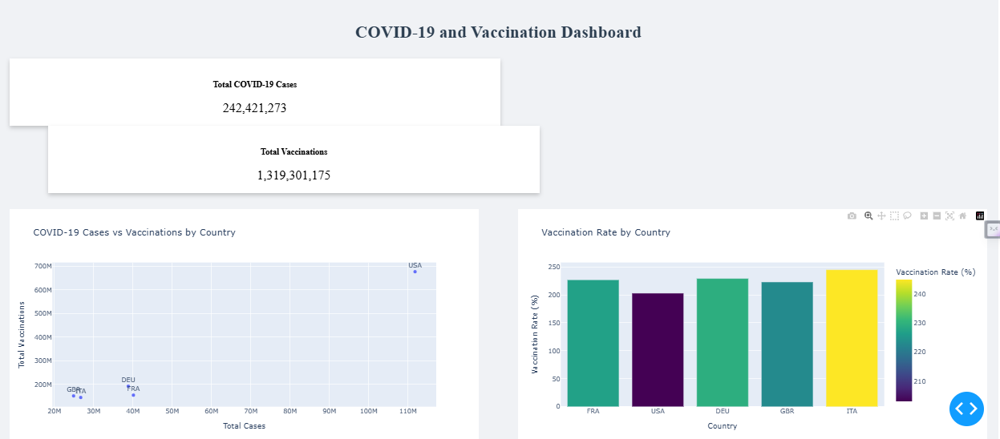

# COVID-19 Data Pipeline and Dashboard

A comprehensive data engineering project that collects, processes, and visualizes COVID-19 and vaccination data from multiple countries. The pipeline automatically updates weekly and presents the data through an interactive dashboard.

## 🌟 Features

- **Automated Data Pipeline**
  - Weekly data collection from reliable sources
  - Data transformation and cleaning
  - Persistent storage in SQLite database
  - Automated scheduling of updates

- **Interactive Dashboard**
  - Real-time visualization of COVID-19 cases and vaccination rates
  - Comparative analysis between countries
  - Auto-refreshing data display
  - Responsive design

- **Data Sources**
  - COVID-19 cases data from disease.sh API
  - Vaccination data from disease.sh API
  - Population data from World Bank API

## 🏗️ Architecture

The project consists of several components:

1. **Data Extraction** (`extract.py`)
   - Fetches data from multiple APIs
   - Handles API authentication and rate limiting
   - Error handling and retry logic

2. **Data Transformation** (`transform.py`)
   - Cleans and standardizes data
   - Calculates key metrics (infection rates, vaccination rates)
   - Merges data from different sources

3. **Data Loading** (`load.py`)
   - Stores processed data in SQLite database
   - Handles database connections and transactions
   - Data versioning and updates

4. **Orchestration** (`orchestrator.py`)
   - Coordinates the ETL pipeline
   - Manages execution flow
   - Error handling and logging

5. **Dashboard** (`dashboard.py`)
   - Built with Dash and Plotly
   - Interactive visualizations
   - Real-time data updates

6. **Configuration** (`config.py`)
   - Scheduling and automation
   - Environment configuration
   - Process management

## 📊 Visualizations

The dashboard includes:
- Total COVID-19 cases and vaccinations
- Cases vs. Vaccinations scatter plot
- Vaccination rates by country
- Comparative analysis of infection and vaccination rates

## 🛠️ Technology Stack

- **Python 3.x**
- **Data Processing**: Pandas
- **Database**: SQLite
- **APIs**: 
  - disease.sh
  - World Bank API
- **Visualization**: 
  - Dash
  - Plotly
- **Scheduling**: schedule library
- **Version Control**: Git

## 🚀 Getting Started

### Prerequisites
```bash
python -m pip install -r requirements.txt
```

### Running the Pipeline
1. Start the scheduler:
```bash
python config.py
```
This will:
- Run the initial data collection
- Start the dashboard
- Schedule weekly updates

2. Access the dashboard at: `http://localhost:8050`

### Manual Execution
To run components individually:
```bash
# Run data pipeline
python orchestrator.py

# Start dashboard only
python dashboard.py
```

## 📁 Project Structure
```
covid_pipeline/
├── README.md
├── requirements.txt
├── config.py           # Configuration and scheduling
├── orchestrator.py     # Pipeline orchestration
├── extract.py         # Data extraction
├── transform.py       # Data transformation
├── load.py           # Database operations
├── dashboard.py      # Web dashboard
└── covid_vaccine.db  # SQLite database
```

## 📊 Sample Dashboard


## 🔄 Update Schedule
- Data is automatically updated every Monday at 00:00
- Dashboard refreshes every 5 minutes
- All operations are logged in `covid_pipeline.log`

## 🤝 Contributing
Feel free to:
1. Fork the repository
2. Create a feature branch
3. Submit a pull request

## 📝 License
This project is licensed under the MIT License - see the LICENSE file for details.

## 🙏 Acknowledgments
- Data provided by [disease.sh](https://disease.sh/)
- World Bank for population data
- Dash and Plotly for visualization tools
